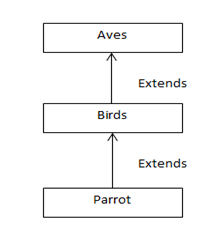

# Problem 2:
Illustrate a multi-level inheritance based on the following relationship:

Here, the class Aves has a method called nature(), class Birds has a method called eat() and class Parrot has a method called food().
