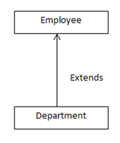

# Problem 4:
Illustrate a single inheritance based on the following relationship:

The class Employee contains the member variables eno and ename to store the employee number and name. The method setemp() assigns the value to eno and ename. The method putemp() prints the value of eno and ename. The class Department contains the member variables dno and dname to store the department number and name. The method setdept() assigns the value to dno and dname. The method putdept() prints the value of dno and dname.

Display the following output:
Empno : 100
Ename : John
Deptno : 20
Deptname : Sales
