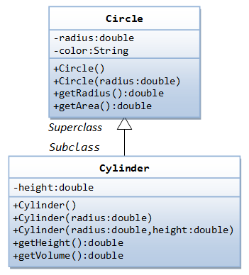

# Problem 5:
From the figure shown create two classes Circle and Cylinder with the member variables and member functions respectively. Create a driver class TestCylinder which invokes the constructor Cylinder() and Cylinder(double radius, double height) to print the radius, height, color, base area and volume of the cylinder.

Base Area of the Cylinder = radius * radius * Math.PI
Volume of the Cylinder = Base Area of the Cylinder * height
